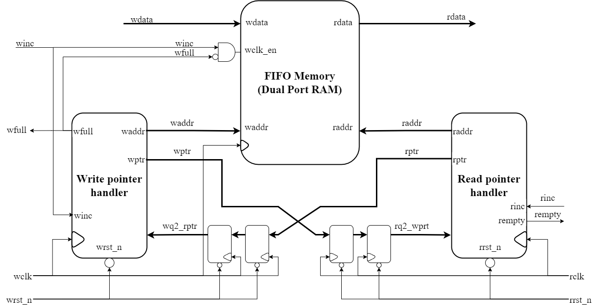
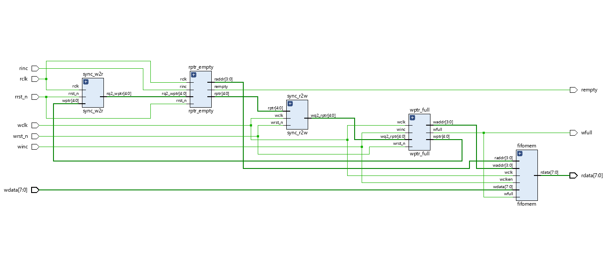
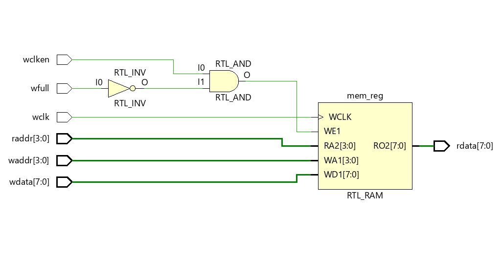
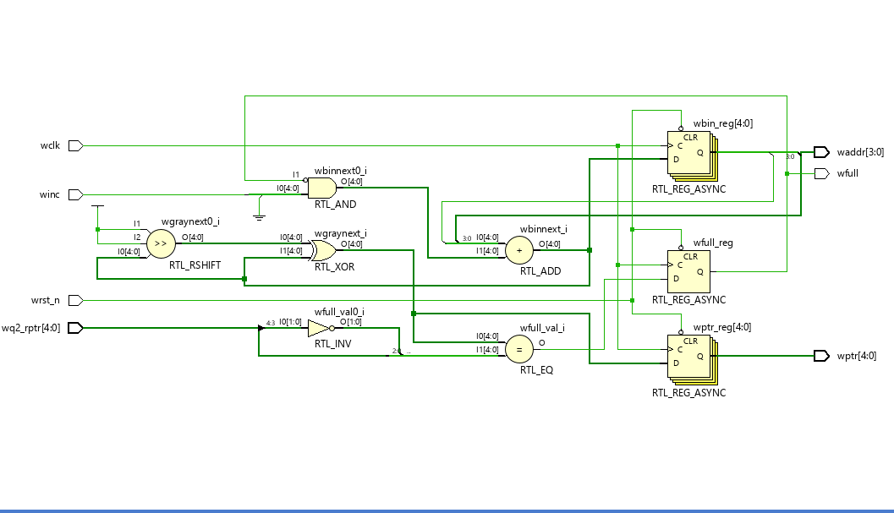
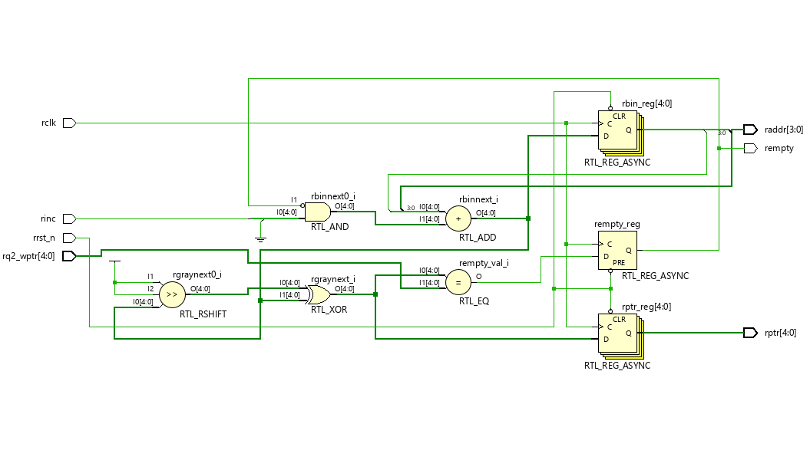
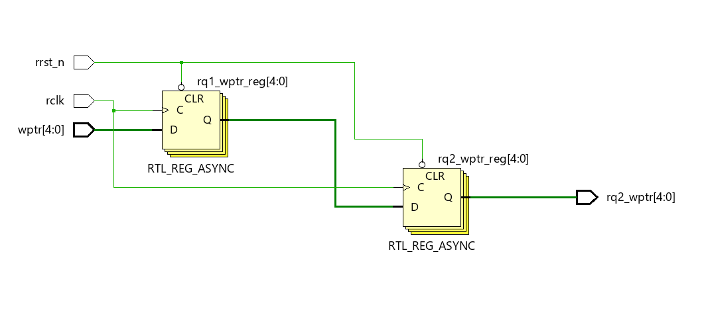
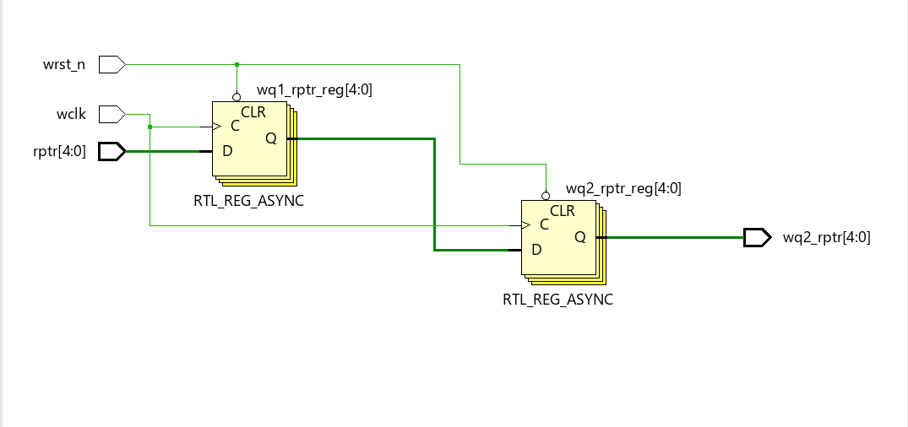
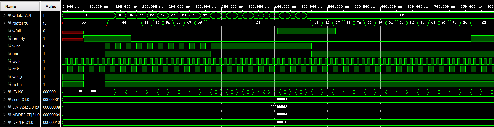

# Asynchronous FIFO Design


## Table of Contents

1. Introduction
2. FIFO Architecture and Design Methodology
3. Read and Write Operation
4. Full, Empty and Wrapping Conditions
5. Gray Code Pointer Synchronization
6. Signal Description
7. RTL Module Description
8. Testbench Verification
9. Simulation Results
10. Conclusion
11. References


# Introduction


FIFO (First-In First-Out) is a storage structure where the first data written into the memory is the first data read from the memory.

FIFO buffers are widely used in digital systems for temporary data storage and transferring data between different processing blocks.


An **Asynchronous FIFO** is a FIFO where read and write operations are controlled by independent clock domains.

Unlike synchronous FIFOs, asynchronous FIFOs use two different clocks:

- Write clock (`wclk`)
- Read clock (`rclk`)


Since these clocks are not synchronized with each other, special Clock Domain Crossing (CDC) techniques are required to safely transfer control information between the two domains.


Asynchronous FIFOs are commonly used in:

- System-on-Chip (SoC) designs
- FPGA-based systems
- Processor-peripheral communication
- High-speed data transfer interfaces
- Multi-clock digital systems


The main objective of this project is to design and verify an asynchronous FIFO using:

- Gray code pointer synchronization
- Two flip-flop synchronizers
- Independent read/write control logic
- Full and empty flag generation


---

# FIFO Architecture and Design Methodology


The implemented asynchronous FIFO consists of five major blocks:


1. FIFO Memory
2. Write Pointer Handler
3. Read Pointer Handler
4. Write-to-Read Pointer Synchronizer
5. Read-to-Write Pointer Synchronizer


The write pointer and read pointer operate in their respective clock domains.

Since the clock domains are asynchronous, pointer information cannot be directly transferred. Therefore, Gray-coded pointers are synchronized using two flip-flop synchronizers.





## Design Parameters


The FIFO is parameterized using:


| Parameter | Description |
|---|---|
| DSIZE | Width of stored data |
| ASIZE | Address width of FIFO memory |
| DEPTH | FIFO storage capacity |


The FIFO depth is calculated as:


```
DEPTH = 2^ASIZE
```


For example:

```
ASIZE = 4

DEPTH = 2^4 = 16 locations
```


---

# Read and Write Operation


## Write Operation


The write operation is controlled by:

- Write clock (`wclk`)
- Write enable (`winc`)
- Write pointer (`wptr`)


When `winc` is asserted and FIFO is not full:

1. Incoming data is written into FIFO memory.
2. Write pointer is incremented.
3. Binary write pointer is converted into Gray code.
4. Gray coded pointer is transferred to read clock domain.


The write pointer always points to the next memory location where data will be stored.


---

## Read Operation


The read operation is controlled by:

- Read clock (`rclk`)
- Read enable (`rinc`)
- Read pointer (`rptr`)


When `rinc` is asserted and FIFO is not empty:

1. Data is read from FIFO memory.
2. Read pointer is incremented.
3. Binary read pointer is converted into Gray code.
4. Read pointer is synchronized into write clock domain.


The read pointer indicates the current FIFO location from where data will be read.


---
---

# Full, Empty and Wrapping Conditions


The asynchronous FIFO must generate two important status flags:

- FIFO Full (`wfull`)
- FIFO Empty (`rempty`)


These flags prevent invalid read and write operations.


---

# FIFO Empty Condition


The FIFO is empty when there is no valid data available for reading.


The empty condition occurs when:


```
Next Read Pointer == Synchronized Write Pointer
```


In this design:

- The write pointer is generated in the write clock domain.
- The Gray coded write pointer is transferred to the read clock domain using `sync_w2r`.
- The synchronized write pointer (`rq2_wptr`) is compared with the next read pointer.


When both pointers are equal, it indicates that the read pointer has caught up with the write pointer, meaning no unread data exists in FIFO.


The `rempty` flag becomes HIGH when FIFO is empty.


---

# FIFO Full Condition


The FIFO is full when no more data can be written into the memory.


The full condition occurs when:


```
Next Write Pointer == Synchronized Read Pointer
```


In this design:

- The read pointer is generated in the read clock domain.
- The Gray coded read pointer is transferred to the write clock domain using `sync_r2w`.
- The synchronized read pointer (`wq2_rptr`) is compared with the next write pointer.


When the write pointer reaches the read pointer after completing one complete FIFO cycle, the FIFO becomes full.


The `wfull` flag becomes HIGH when FIFO is full.


---

# Wrapping Condition


A problem occurs when both read and write pointers become equal.

The condition:

```
Write Pointer == Read Pointer
```

can represent both:

- FIFO empty
- FIFO full


To distinguish between these two conditions, an extra Most Significant Bit (MSB) is added to both pointers.


The extra MSB indicates the number of times the pointer has wrapped around the FIFO memory.


Example:


For a FIFO depth of 16:

```
Address bits = 4

Pointer size = 5 bits
```


The lower 4 bits represent the memory address, while the extra bit indicates pointer wrapping.


When:

```
MSB of write pointer != MSB of read pointer
```

the write pointer has completed one additional cycle and FIFO is full.


When:

```
MSB of write pointer == MSB of read pointer
```

both pointers are in the same memory cycle.


This additional bit allows correct detection of full and empty states.


---

# Gray Code Pointer Synchronization


## Need for Gray Code


In asynchronous FIFO design, pointers need to cross between two independent clock domains.

A binary counter is not suitable for direct synchronization because multiple bits can change simultaneously during a transition.


Example:


Binary transition:

```
0111 -> 1000
```


Here four bits change at the same time.

If the receiving clock samples the pointer during transition, an incorrect value may be captured.


To solve this problem, Gray code representation is used.


---

# Gray Code Counter


Gray code has the property that only one bit changes during consecutive transitions.


Example:


Binary:

```
000
001
010
011
100
```


Gray:

```
000
001
011
010
110
```


Since only one bit changes between adjacent Gray code values, the probability of capturing an invalid pointer value is reduced.


In this FIFO:

1. Binary pointer is generated locally.
2. Binary pointer is converted into Gray code.
3. Gray pointer is synchronized into the opposite clock domain.
4. The synchronized Gray pointer is used for full/empty detection.


---

# Clock Domain Crossing Synchronization


Direct transfer of multi-bit signals between asynchronous clock domains can create metastability.


Therefore, this design uses a two flip-flop synchronizer.


The synchronization process:


```
Source Clock Domain

       Gray Pointer
             |
             |
            FF1
             |
            FF2
             |
Destination Clock Domain
```


The first flip-flop may become metastable, but the second flip-flop provides a stable synchronized output.


---

# Signal Description


| Signal | Description |
|---|---|
| wclk | Write clock signal |
| rclk | Read clock signal |
| wdata | Input data written into FIFO |
| rdata | Output data read from FIFO |
| winc | Write enable signal |
| rinc | Read enable signal |
| waddr | Binary write address |
| raddr | Binary read address |
| wptr | Gray coded write pointer |
| rptr | Gray coded read pointer |
| wfull | FIFO full indication |
| rempty | FIFO empty indication |
| wq2_rptr | Synchronized read pointer in write domain |
| rq2_wptr | Synchronized write pointer in read domain |
| wrst_n | Active low write domain reset |
| rrst_n | Active low read domain reset |


---
---

# RTL Design Implementation


The asynchronous FIFO design is divided into multiple RTL modules. Each module performs a specific operation required for safe data transfer between two independent clock domains.


The implemented modules are:


| Module | Description |
|---|---|
| fifo_top.v | Top-level FIFO integration module |
| fifomem.v | FIFO memory storage |
| wptr_full.v | Write pointer generation and full flag logic |
| rptr_empty.v | Read pointer generation and empty flag logic |
| sync_w2r.v | Write pointer synchronization into read domain |
| sync_r2w.v | Read pointer synchronization into write domain |
| two_ff_sync.v | Two flip-flop CDC synchronizer |


---

# 1. FIFO Top Module (`fifo_top.v`)


The `fifo_top` module is the top-level wrapper of the asynchronous FIFO design.


This module integrates all FIFO sub-blocks:


- FIFO memory
- Write pointer handler
- Read pointer handler
- Write-to-read synchronizer
- Read-to-write synchronizer


The module contains two independent clock domains:


### Write Clock Domain

The write domain is controlled by:

- `wclk`
- `wrst_n`
- `winc`


It generates the write pointer and controls the FIFO memory write operation.


### Read Clock Domain

The read domain is controlled by:

- `rclk`
- `rrst_n`
- `rinc`


It generates the read pointer and controls FIFO memory read operation.


The write pointer is transferred to the read domain using `sync_w2r`.

The read pointer is transferred to the write domain using `sync_r2w`.


The top module generates:

- `wfull` : FIFO full status
- `rempty` : FIFO empty status
- `rdata` : FIFO output data


### RTL Schematic





---

# 2. FIFO Memory Module (`fifomem.v`)


The `fifomem` module implements the storage element of the FIFO.


The memory is implemented as an array:


```
reg [DATASIZE-1:0] mem [0:DEPTH-1];
```


The FIFO depth is calculated using:


```
DEPTH = 2^ADDRSIZE
```


The module uses:


### Write Operation


The write operation occurs at the rising edge of `wclk`.


Data is written only when:


```
wclken = 1
and
wfull = 0
```


This prevents writing new data when FIFO memory is already full.


### Read Operation


The read operation is asynchronous.


The output data is continuously assigned based on the read address:


```
rdata = mem[raddr]
```


### Functions


- Store input data
- Provide output data
- Control write access
- Prevent overflow condition


### RTL Schematic





---

# 3. Write Pointer and Full Logic (`wptr_full.v`)


The `wptr_full` module manages all write-side operations.


The main functions of this module are:


- Generate binary write pointer
- Convert binary pointer into Gray code
- Generate FIFO memory write address
- Generate FIFO full flag


The binary write pointer is used for memory addressing:


```
waddr = wbin[ADDRSIZE-1:0]
```


The next write pointer is calculated as:


```
wbinnext = wbin + (winc & ~wfull)
```


This means the pointer increments only when:

- Write request is active
- FIFO is not full


The binary pointer is converted into Gray code using:


```
wgraynext = (wbinnext >> 1) ^ wbinnext
```


The Gray coded pointer is transferred to the read domain for synchronization.


## Full Flag Generation


The FIFO full condition is detected by comparing:

- Next write pointer
- Synchronized read pointer


When the next write pointer reaches the synchronized read pointer position, FIFO becomes full.


### RTL Schematic





---
---

# 4. Read Pointer and Empty Logic (`rptr_empty.v`)


The `rptr_empty` module manages all read-side operations of the asynchronous FIFO.


The main functions of this module are:


- Generate binary read pointer
- Convert binary pointer into Gray code
- Generate FIFO memory read address
- Generate FIFO empty flag


The binary read pointer is used for memory addressing:


```
raddr = rbin[ADDRSIZE-1:0]
```


The next read pointer is calculated as:


```
rbinnext = rbin + (rinc & ~rempty)
```


The read pointer increments only when:

- Read request is active
- FIFO is not empty


The binary pointer is converted into Gray code using:


```
rgraynext = (rbinnext >> 1) ^ rbinnext
```


The Gray coded read pointer is transferred to the write clock domain using the `sync_r2w` synchronizer.


---

## Empty Flag Generation


The FIFO empty condition is detected by comparing:


- Next read pointer
- Synchronized write pointer


When both pointers are equal:


```
rgraynext == rq2_wptr
```


the FIFO does not contain any unread data.


Therefore:


```
rempty = 1
```


The empty flag prevents invalid read operations from occurring.


### RTL Schematic





---

# 5. Write-to-Read Synchronizer (`sync_w2r.v`)


The `sync_w2r` module transfers the Gray coded write pointer from the write clock domain to the read clock domain.


Since `wclk` and `rclk` are asynchronous, direct sampling of the write pointer may introduce metastability.


To solve this problem, a two flip-flop synchronizer is used.


The synchronization process:


```
Write Clock Domain

        wptr
         |
         |
        FF1
         |
        FF2
         |
Read Clock Domain

       rq2_wptr
```


The synchronized write pointer (`rq2_wptr`) is used by the read pointer logic to generate the empty flag.


### Working


1. Write pointer is generated in write clock domain.
2. Pointer is converted into Gray code.
3. Gray coded pointer enters first synchronizer flip-flop.
4. Second flip-flop provides stable synchronized output.
5. Read domain uses synchronized pointer.


### RTL Schematic





---

# 6. Read-to-Write Synchronizer (`sync_r2w.v`)


The `sync_r2w` module transfers the Gray coded read pointer from the read clock domain to the write clock domain.


Similar to the write-to-read synchronizer, this module uses two flip-flops to reduce metastability probability.


The synchronization process:


```
Read Clock Domain

        rptr
         |
         |
        FF1
         |
        FF2
         |
Write Clock Domain

       wq2_rptr
```


The synchronized read pointer (`wq2_rptr`) is used by the write pointer logic to generate the full flag.


### Working


1. Read pointer is generated in read clock domain.
2. Pointer is converted into Gray code.
3. Gray coded pointer is synchronized into write domain.
4. Write domain uses synchronized pointer for full detection.


### RTL Schematic





---

# 7. Two Flip-Flop Synchronizer (`two_ff_sync.v`)


The `two_ff_sync` module implements a standard CDC synchronizer.


A single flip-flop is not sufficient for asynchronous signal transfer because the receiving flip-flop can enter a metastable state.


The two flip-flop synchronizer reduces the probability of metastability propagation.


The operation is:


```
Asynchronous Signal

        |
        |
       FF1
        |
       FF2
        |
Synchronized Output
```


### Operation


- First flip-flop samples the asynchronous input.
- Second flip-flop receives the output of the first flip-flop.
- The second flip-flop output is used by the receiving logic.


This technique is widely used in multi-clock digital systems for reliable CDC.


---

# Complete RTL Block Summary


| Module | Function |
|---|---|
| fifo_top.v | Integrates complete asynchronous FIFO |
| fifomem.v | Stores FIFO data |
| wptr_full.v | Generates write pointer and full flag |
| rptr_empty.v | Generates read pointer and empty flag |
| sync_w2r.v | Synchronizes write pointer into read domain |
| sync_r2w.v | Synchronizes read pointer into write domain |
| two_ff_sync.v | Provides metastability protection |


---
---

# Testbench Implementation


The asynchronous FIFO design was verified using a Verilog testbench.


The testbench generates:

- Independent write clock
- Independent read clock
- Random input data
- Read and write enable signals
- Reset signals


The testbench applies different operating conditions to verify the correct functionality of the FIFO.


## Verification Flow


The verification process includes:


1. Applying asynchronous reset to initialize the FIFO.

2. Performing write operations by enabling `winc`.

3. Performing read operations by enabling `rinc`.

4. Monitoring `wfull` and `rempty` status flags.

5. Comparing written data with read data to verify correct storage and retrieval.


---

# Test Cases


## Test Case 1: Normal Write and Read Operation


In this test case:

- Data is written into FIFO memory.
- Read operation is performed after writing.
- Read data is compared with expected written data.


Expected Result:


- All written data should be read correctly.
- No data corruption should occur.


---

## Test Case 2: FIFO Full Condition


In this test case:

- Continuous write operations are performed until FIFO becomes full.
- Additional write attempts are applied.


Expected Result:


- `wfull` flag should become HIGH.
- Further write operations should be blocked.


---

## Test Case 3: FIFO Empty Condition


In this test case:

- Read operations are performed when FIFO has no valid data.


Expected Result:


- `rempty` flag should become HIGH.
- Further read operations should be blocked.


---

## Test Case 4: Simultaneous Read and Write Operation


In this test case:

- Read and write operations occur simultaneously.
- Different clock frequencies are applied.


Expected Result:


- FIFO should continue transferring data correctly.
- No data loss should occur.


---

# Simulation Results


The asynchronous FIFO was simulated using Verilog simulation.


The simulation verifies:

- Correct write operation
- Correct read operation
- Full flag generation
- Empty flag generation
- Proper pointer synchronization
- Safe data transfer between asynchronous clock domains


## Simulation Waveform





---

# Results


The asynchronous FIFO design was successfully verified using the testbench.


The following results were observed:


### 1. Correct Data Storage and Retrieval


The FIFO correctly stores incoming data during write operations and provides the same data during read operations.


### 2. Full Condition Verification


When FIFO memory becomes completely occupied:


- `wfull` signal becomes HIGH.
- Further write operations are prevented.


### 3. Empty Condition Verification


When all stored data is read:


- `rempty` signal becomes HIGH.
- Further read operations are prevented.


### 4. Clock Domain Crossing Verification


The Gray code pointer synchronization and two flip-flop synchronizers successfully transfer pointer information between independent clock domains.


---

# Conclusion


In this project, a parameterized asynchronous FIFO was designed and verified using Verilog HDL.


The design successfully implements:


- Independent read and write clock domains
- Gray code based pointer synchronization
- Two flip-flop CDC synchronizers
- Full and empty flag generation
- Reliable data transfer between asynchronous clock domains


The simulation results confirm that the FIFO operates correctly under different read and write conditions.


Asynchronous FIFOs are essential components in modern digital systems, especially in SoC and FPGA designs where multiple modules operate at different clock frequencies.


---

# References


1. Clifford E. Cummings,

**Simulation and Synthesis Techniques for Asynchronous FIFO Design**


Sunburst Design Inc.


2. VLSI Verify Blog,

**Asynchronous FIFO Design**


3. Verilog HDL documentation and CDC design guidelines.


---
---

# Author

[**Yashwant Kushwah**](https://www.linkedin.com/in/yashwant-kushwah-2a590124a/)

M.Tech Electrical Engineering  
Indian Institute of Technology Bombay

GitHub: [yashwant2201](https://github.com/yashwant2201)

---